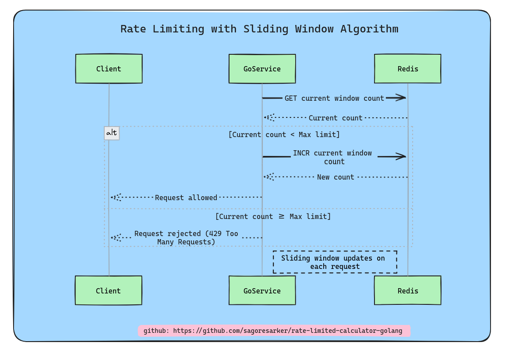

# Rate-limited Calculator Documentation

## Table of Contents

- [Project Details](#project-details)
  - [What I exactly implement here](#what-i-exactly-implement-here)
  - [How Sliding Window Algorithm Works Here](#how-sliding-window-algorithm-works-here)
  - [Archetecture of the implemented system](#archetecture-of-the-implemented-system)
- [Run and Test the Project](#run-and-test-the-project)
  - [Prerequisite](#prerequisite)
  - [Setup](#setup)
  - [Run unit test](#run-unit-test)
  - [Endpoints](#endpoints)

Before diving into setup and test, firt describe a bit more about this project.

## What I exactly implement here
I implemented a rate-limited calculator service in GoLang, utilizing a sliding window algorithm for rate limiting and Redis for data storage.

## How Sliding Window Algorithm Works Here
In this system, the sliding window algorithm works by maintaining a record of request timestamps for each user within a specified time window (e.g., one minute). When a new request comes in, the algorithm checks the timestamps and removes any that fall outside the current window. It then counts the remaining timestamps. If the count is below the allowed limit, the request is accepted and the current timestamp is added to the record. If the count exceeds the limit, the request is denied.

## Archetecture of the implemented system
In my system, the sliding window algorithm is used to limit the number of requests a user can make within a given time frame. Here's how it works:




## Prerequisite
1. redis
2. docker
3. Go
4. make (not required)


## Setup

To get started with this project, follow these steps:

1. Clone this repository to local machine using `git clone https://github.com/sagoresarker/rate-limited-calculator-golang.git`.
2. Navigate to the project directory: `cd rate-limited-calculator-golang`.
3. Install project dependencies by running: `go mod tidy`. (sometime it required to remove ```go.sum``` file before run this)
4. Start redis container: `docker-compose up -d`

## Run unit test
To run unit test, if you already have `make` tool on your system, you can run the test by just

```bash
make test
```

If you don't have make in your system, just run
```bash
go test ./...
```

## Endpoints

This document provides a brief overview of the one API endpoints in the `handlers.go` file.

### Payload structure
Payload contain the operation name(calculator_type), username, and numbers.

```json
{
    "username": "testuser",
    "calculator_type": "add",
    "number1": 10,
    "number2": 5
}
```

Currently there are ```7``` calculator_type, these are
```bash
calculator_type
- add
- subtract
- multiply
- divide
- modulo
- power
- factorial
```

### 1. POST /calculate

This endpoint is used to send a ```POST``` request to ```/calculator``` endpoint with a specific configuration.

**Request Body:** This endpoint require ```username, calculator_type, numbers``` in the  payload in the POST request.

```json
{
    "username": "testuser",
    "calculator_type": "multiply",
    "number1": 10,
    "number2": 5
}
```

**Response:** The response will contain the status of the operation and result.
```json
{
    "result": 20,
}
```


In error case,
```json
{
  "result": 0,
  "error": "division by zero"
}
```

And in rate limit senario, it return with status code ```429 Too Many Requests```

```json
{
  "result": 0,
  "error": "rate limit exceeded"
}
```

To test these endpoints, you can check the [endpoint-test.http](./endpoint-test.http) file in the repo. Also, you can use any tools.

Here is the `curl` commands to test this  endpoint locally for addition:

### 1. Addition

```bash
curl -X POST http://localhost:8080/calculate \
-H "Content-Type: application/json" \
-d '{
    "username": "testuser",
    "calculator_type": "add",
    "number1": 10,
    "number2": 5
}'
```

### 2. Subtraction

```bash
curl -X POST http://localhost:8080/calculate \
-H "Content-Type: application/json" \
-d '{
    "username": "testuser",
    "calculator_type": "subtract",
    "number1": 10,
    "number2": 5
}'
```

### 3. Multiplication

```bash
curl -X POST http://localhost:8080/calculate \
-H "Content-Type: application/json" \
-d '{
    "username": "testuser",
    "calculator_type": "multiply",
    "number1": 10,
    "number2": 5
}'
```


### 4. Division

```bash
curl -X POST http://localhost:8080/calculate \
-H "Content-Type: application/json" \
-d '{
    "username": "testuser",
    "calculator_type": "divide",
    "number1": 10,
    "number2": 5
}'
```

### 5. Modulo

```bash
curl -X POST http://localhost:8080/calculate \
-H "Content-Type: application/json" \
-d '{
    "username": "testuser",
    "calculator_type": "modulo",
    "number1": 10,
    "number2": 5
}'
```

### 6. Power

```bash
curl -X POST http://localhost:8080/calculate \
-H "Content-Type: application/json" \
-d '{
    "username": "testuser",
    "calculator_type": "power",
    "number1": 10,
    "number2": 5
}'
```

### 7. Factorial

```bash
curl -X POST http://localhost:8080/calculate \
-H "Content-Type: application/json" \
-d '{
    "username": "testuser",
    "calculator_type": "factorial",
    "number1": 5
}'
```


When it reaches it limits, the server will return a ```429 Too Many Requests```


Thats it


